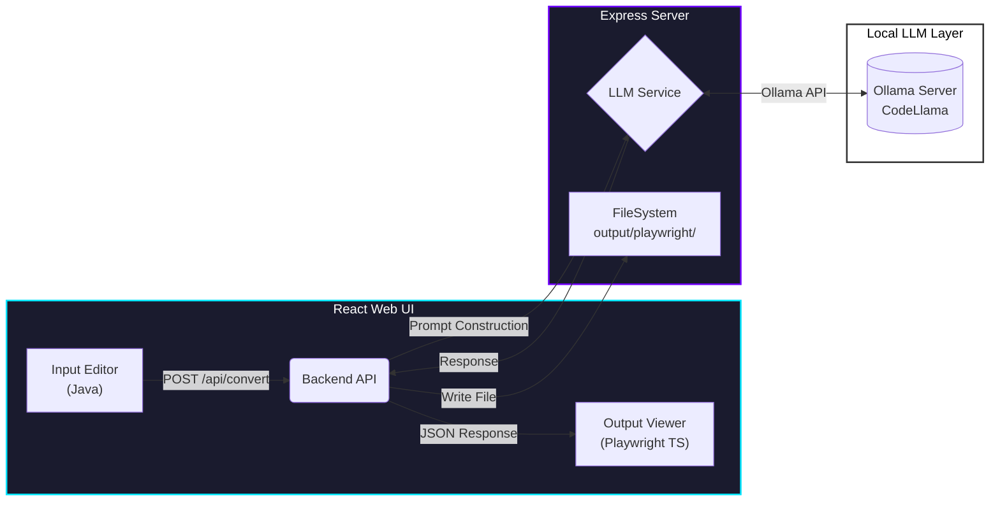

# 🔄 Selenium to Playwright Converter (Local LLM)

A premium, privacy-focused tool that uses a **Local Large Language Model (LLM)** to convert legacy Selenium Java code into modern Playwright TypeScript test specifications.


-white.svg)

---

## 🏗 System Architecture

The application follows a 3-tier architecture designed for privacy and speed. No code leaves your local machine.



## ✨ Features

- **🔒 100% Local Privacy**: Your proprietary test code never touches the cloud. All inference is done locally via Ollama.
- **⚡ Real-Time Conversion**: Instant translation from Selenium's `WebDriver` patterns to Playwright's `Locators` and `auto-waiting`.
- **🎨 Premium UI**: A deep-space, glassmorphic dark mode designed for developer focus.
- **💾 Auto-Save**: Automatically saves generated spec files to `output/playwright` for immediate use.

## 🚀 Getting Started

### Prerequisites

1.  **Node.js** (v18+)
2.  **Ollama** installed and running.
    *   Install from [ollama.com](https://ollama.com)
    *   Pull the model: `ollama pull codellama`

### Installation

```bash
# Clone the repository
git clone <your-repo-url>
cd selenium-to-playwright-local-llm

# Install dependencies (Root + Frontend)
npm install
cd frontend && npm install && cd ..
```

### Configuration

Create a `.env` file in the root directory (already set up by default):

```env
LLM_API_URL=http://localhost:11434/api/generate
LLM_MODEL=codellama:latest
PORT=3001
```

### Usage

Run the full stack (Backend + Frontend) with a single command:

```bash
npm run dev
```

- **Frontend**: Open [http://localhost:5173](http://localhost:5173) to access the UI.
- **Backend**: API runs on `http://localhost:3001`.
- **Output**: Check the `output/playwright` folder for generated `.spec.ts` files.

## 🛠️ Tech Stack

- **Frontend**: React, Vite, Vanilla CSS (Variables + Theming).
- **Backend**: Express.js, TypeScript, Axios.
- **AI/ML**: Ollama API, CodeLlama (7b/13b/34b).
- **Tooling**: `concurrently`, `tsx`.

## 🤝 Contributing

1.  Fork the repo.
2.  Create your feature branch (`git checkout -b feature/amazing-feature`).
3.  Commit your changes (`git commit -m 'Add amazing feature'`).
4.  Push to the branch (`git push origin feature/amazing-feature`).
5.  Open a Pull Request.

---

*Powered by Antigravity*
